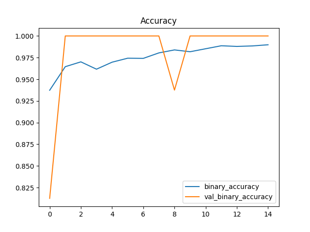
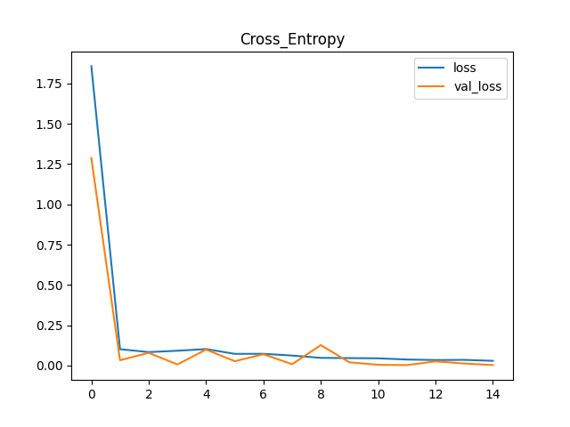

# Pneumonia Detection via Chest X-Rays
**Validation Accuracy: 85%** | **Built with TensorFlow & VGG16**

## Why this project?
I built this to see how effectively Deep Learning can assist in medical screenings. Diagnosing pneumonia from X-rays can be subjective and time-consuming; this model aims to provide a reliable "second opinion" to help prioritize urgent cases in a clinical setting.

## The Technical Approach (What I actually did)
Instead of building a model from scratch, I used **Transfer Learning** with **VGG16**. Since VGG16 was trained on millions of images, it already understands "shapes." I just had to fine-tune the final layers to understand "lungs."

* **Handling the Data:** Medical data is tricky. I used **Data Augmentation** (zooming and rotating) to make the model more robust so it doesn't just memorize the training images.
* **The Struggle with Overfitting:** Early versions of the model were "over-learning" the training set. I added **Dropout layers** to force the network to find more general patterns.
* **Final Result:** Hit a solid **85% accuracy** on the test set.

### Proof of Performance
Here are the training curves. You can see the model steadily improving without significant overfitting, which was my main goal during the fine-tuning phase.

**Accuracy Curve:**

**Loss Curve:**

---

## How to see the results

### 1. Just browsing?
Click the `.ipynb` file right here on GitHub. I've left comments in the code explaining each step and included the final Accuracy/Loss graphs at the bottom.

### 2. Want to run it? (Google Colab)
The easiest way is to open this in [Google Colab](https://colab.research.google.com/). Just go to the "GitHub" tab and paste this URL: `https://github.com/Awais123-creator/Pneumonia_Detection`

### 3. Local / Docker Setup
If you want to run this locally:
1. Clone the repo: `git clone https://github.com/Awais123-creator/Pneumonia_Detection.git`
2. Install the tools: `pip install -r requirements.txt`
3. Run `jupyter notebook`

*Note: I’ve also included a **Dockerfile** for those who prefer containerized environments to avoid versioning headaches.*

---
